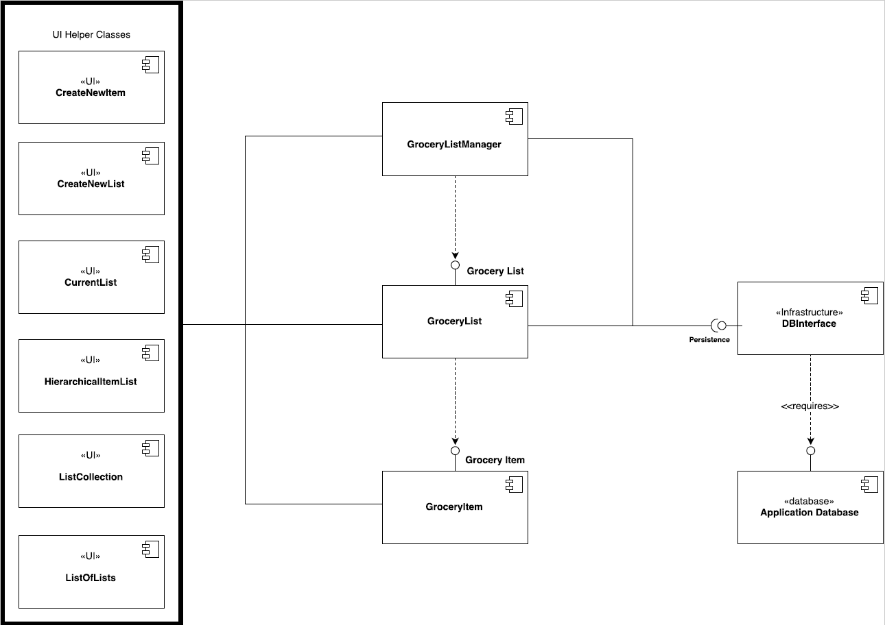
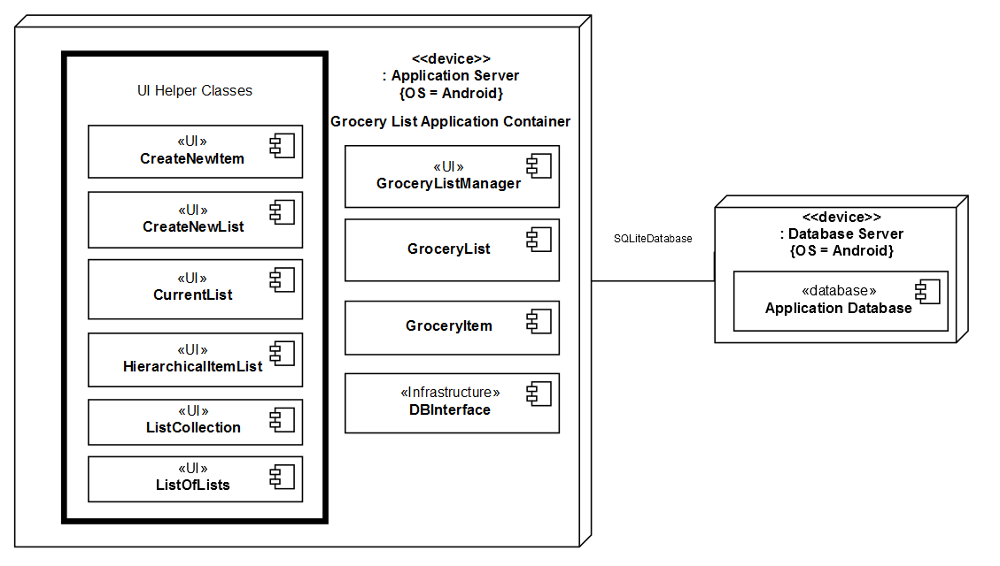
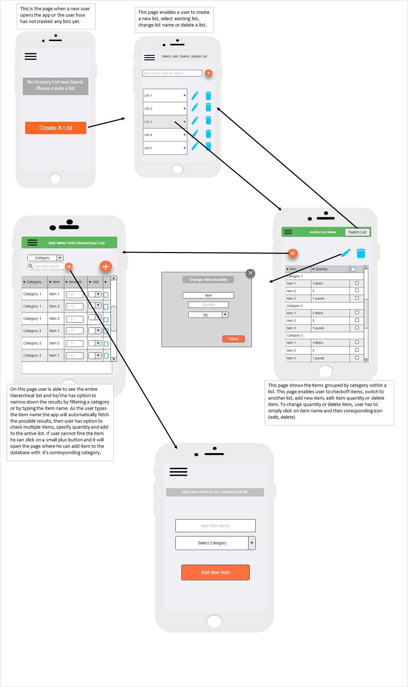

# Design Document

**Author**: Team 69

## 1 Design Considerations

### 1.1 Assumptions

- Application will only be used by one user, and therefore there is no need for a login mechanism
- Application and Database will run on same Android device

### 1.2 Constraints

-  Application will only run on Android devices (Phones & Tablets)

### 1.3 System Environment

Application runs on Android devices (Phones & Tablets) supporting Android API 19 (KitKat) or later.

## 2 Architectural Design

### 2.1 Component Diagram

### 2.2 Deployment Diagram

## 3 Low-Level Design

### 3.1 Class Diagram

## 4 User Interface Design

