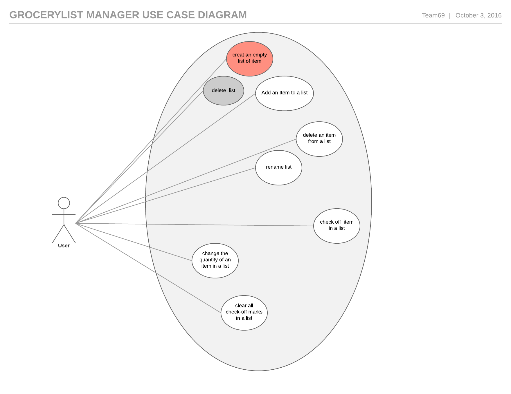

#Use Case Model

**Author** : Team69

## 1 Use Case Diagram

## 2 Use Case Descriptions

### Create an an empty list of item
- Requirement:The application must provide the user with the ability to create a list
- Pre-conditions: The GroceryList android app must have already been started by user
- Post-conditions: The  new list created by the user will now become part of the lists of grocery list that is currently being maintained the user
- Scenarios: 
 - The normal sequence of event are:  a)The user click on the "create new grocery list" button b)The user  enters the name of the grocery list c)Then the application retrieves the name entered by the user , if no grocery list exist with that name the application creates a new grocery  list that has the name entered by the user.
 - An exceptional sequence of event is : the user enters a list that already exist , in this scenario the create new list operation will fail and the application will return reason for the failure to the user.

### Add an item to the list by picking from an Hierarchical list
- Requirement:Users must be able to add items to a list by picking them from a hierarchical list, where the first level is the item type (e.g., cereal), and the second level is the name of the actual item (e.g., shredded wheat).Users must also be able to specify an item by typing its name
- Pre-conditions: 
 - The GroceryList android app must have been started by the user
 - The application must already contains at least one type of item with at least one item
- Post-conditions: The user should see the new items entered while viewing the grocery list
- Scenarios:
 - The normal sequence of event is:a)The user select a grocery list for which to add an item to b)The user select an item type c) the application retrieves the item type selected by the user and present the list of item for the selected type d) the user select an item from the list e) the user enters the quantity for the selected f) the user click on submit g) the user repeat steps a-f above or click on exit to return to the main menu.
 - An Alternative sequence of event is : a) The user select a grocery list b) the user enters the name of the item c) the application searches for item that corresponds to name entered by the user and present the list of item found with the correponding type to the user d) the user select an item from the list provided by the application, select a quantity and add the selected item to the grocery list , if the application returns an empty list the user will enter a type for the item , the application will save the new item after the it has been added by the user to the grocery list e) the user can repeat the steps above or click on exit to return to the main menu.

### delete list

- Requirement:The application must provide the users with the ability to delete a list
- Pre-conditions: The GroceryList android app must have already been started by user
- Post-conditions: The deleted list will no longer appear in the list of grocery list currently managed by the user

- Scenarios: 
 - The normal sequence of event are : The user select the list to be deleted from the list of grocery list being managed by the user b) The user click on submit and the list is deleted by the application. c) the user can return to the main menu by clicking cancel or repeat the steps above to delete another list.

### delete an item from a list
- Requirement:The application must provide the users with the ability to delete an item from a list
- Pre-conditions:
 - The GroceryList android app must have already been started by user
 - The list must contains at least an item
- Post-conditions: The deleted item will no longer appear in the list

- Scenarios: 
 - the normal sequence of event are: a) the user select a list b) select an item from the list and click on "delete item" c) the application delete the selected item from the list 
 - The alternative sequence of operation are : a) the user select a list b) view all items in the list c)select an item from the list and click on "delete item" d) the application delete the selected item from the list 

### rename list
- Requirement:The application must provide the users with the ability to rename a list
- Pre-conditions: The GroceryList android app must have already been started by user
- Post-conditions: The list will now have its new name in the list of grocery list currently managed by the user. The old name will no longer appear . Note that the new list is same as the old one , just a name change occur.

- Scenarios: 
 - The normal sequence of event are : The user select the list to be rename from the list of grecery list maintained by the user b) the user enters the new name and click on "submit" c) the application renames the list to the new name entered by the user.

###  checkoff item in a list
- Requirement:Users must be able to check off items in a list
- Pre-conditions: 
 - The GroceryList android app must have already been started by user

- Post-conditions: The item marked as check off will no longer appear in the grocery list
- Scenarios: 
 - The normal sequence of event are : The user select the list  from the list of grecery list maintained by the user b) the user select an item c) the user check the "check off" button . d) the application check-off the item e) the user can repeat the steps above or return to the main menu by click exit.

###  change item quantity
- Requirement:Users must be able to change the quantity of an item
- Pre-conditions: 
 - The GroceryList android app must have already been started by user

- Post-conditions: The quanitity of the item will be change to the new quantity entered by the user
- Scenarios: 
 - The normal sequence of event are : The user select the list  from the list of grecery list maintained by the user b) the user select an item c) the user update the item quantity . d) The user submit this changes  e) the user can repeat the steps above or return to the main menu by click exit.

###  clear all check off mark in a list
- Requirement:Users must also be able to clear all the check-off marks in a list at once.
- Pre-conditions: 
 - The GroceryList android app must have already been started by user

- Post-conditions: All check-off mark will be removed from the list i.e items marked as check off will appear again in the grocery list since the check has been cleared.
- Scenarios: 
 - The normal sequence of event are : The user select the list  from the list of grecery list maintained by the user b) the user clears all off mark in the list  c) The user submit this changes  e) the user can repeat the steps above or return to the main menu by click exit.

 
