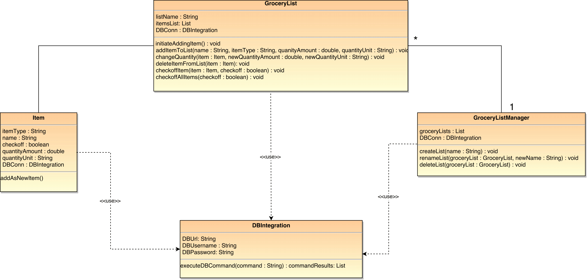
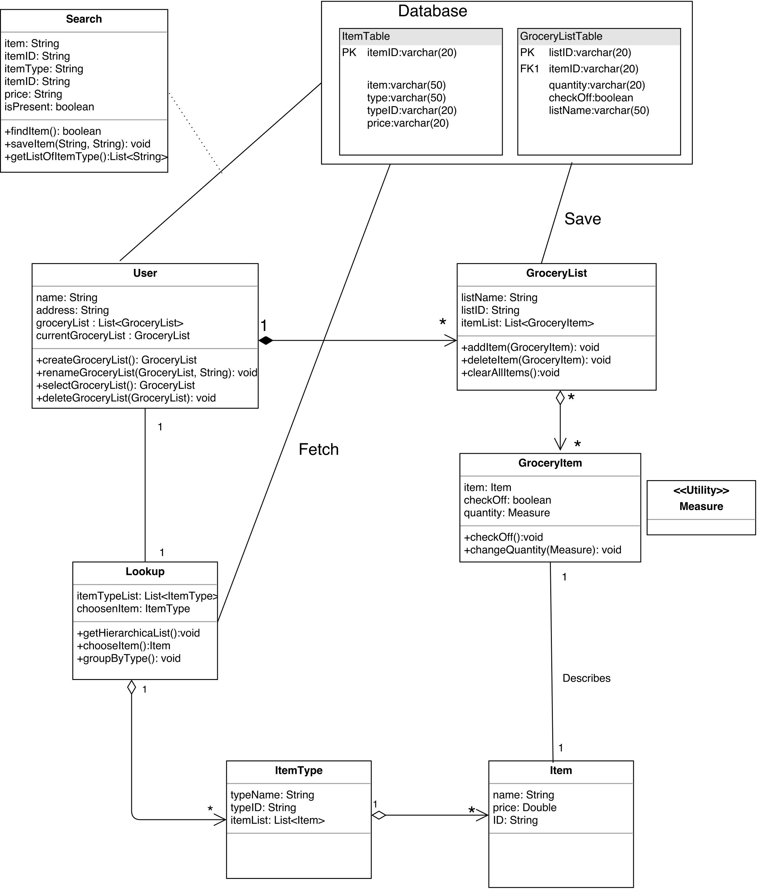
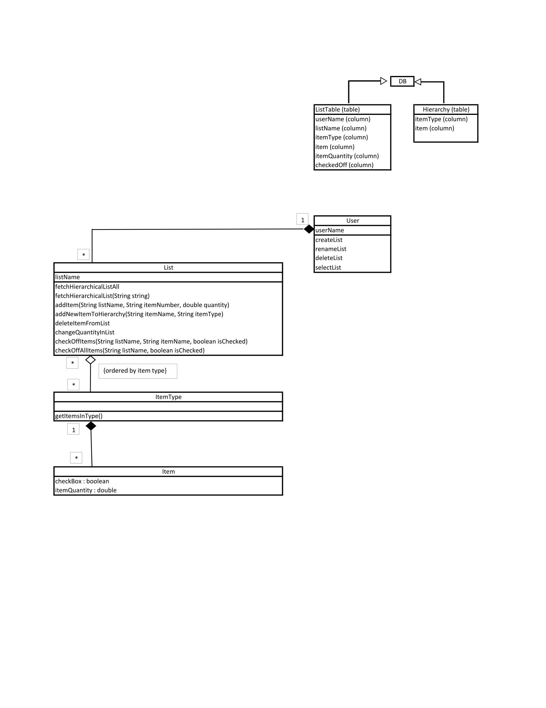
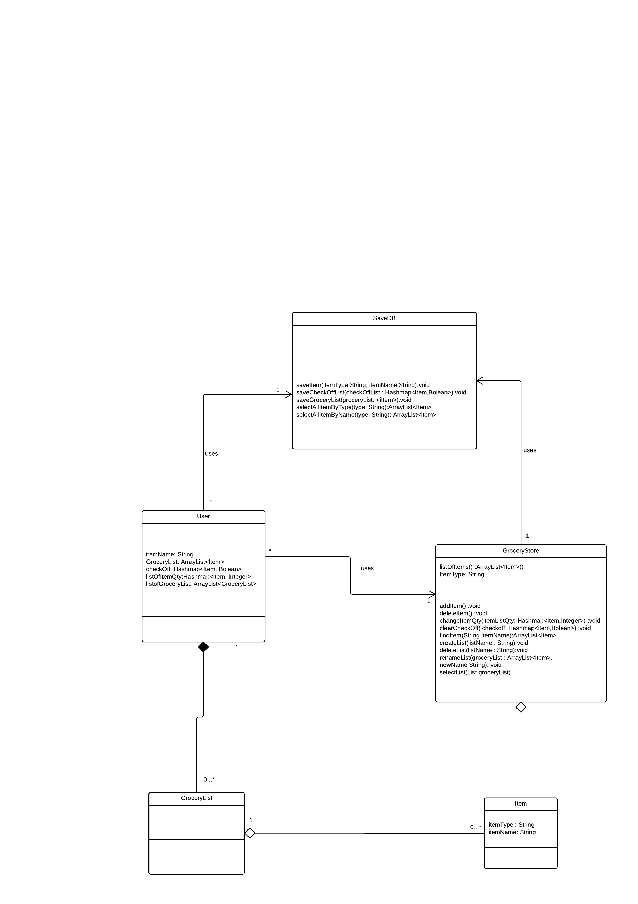

<h2>Indivigual Designs</h2>
<h3>Design 1</h3>

<h3>pros </h3>
<ul>
<li>Having a DBIntegration class provides single entry into the database. It will help in Unit testing and better error handling.
<li>Simple while modeling the requirements correctly.
</ul>

<h3>cons </h3>
<ul>
<li>User should be able to choose the grocery list from the lists and we feel that method should be part of GroceryListManager.
<li>Seems to be more DB oriented
</ul>

<h3>Design 2</h3>

<h3>pros </h3>
<ul>
<li>Accurately covers all the requirement in the design</li>
<li>decoupling of the ItemType from the Item.
</ul>
<h3>cons </h3>
<ul>
<li>The design is a bit complex and can be optimized better
</ul>

<h3>Design 3</h3>

<h3>pros </h3>
<ul>
<li>very elegant, concise and easy to understand design.</li>
<li> Clear representation of the classes and their relationships

</ul>
<h3>cons </h3>
<ul>
<li>List consists of items and there should be direct relationship between the list and the item.
</ul>

<h3>Design 4</h3>

<h3>pros </h3>
<ul>
<li> Clear representation of the classes and their relationships
</ul>

<h3>cons </h3>
<ul>
<li>Having a GroceryStore as a class was not part of the requirement. Behaviors part of GroceryStore should have been included in the GroceryList class.
<li>Does not model the requirements in a simple manner
</ul>

<h2>Team Design</h2>

<h3>Commonalities and Differences:</h3>
<h3>Design 1</h3>
<h4>Commonalities:</h4>
<ul>
<li>Single entry point to the database.
<li>Class methods and attributes are somewhat similar
</ul>
<h4>Differences:</h4>
<ul>
<li>GroceryItem and Item are merged into one class, unlike the team design where they are separated into two classes.Decoupling the GroceryItem from the Item class enables the GroceryItem to have additional peculiar attribute like checkoff and quantity. 
<li>Missed the multiplicity between the Item and GroceryList, the team design accurately indicated the multiplicity i.e Grocery can have multiple item as stated in the requirement 
</ul>

<h3>Design 2</h3>
<h4>Commonalities:</h4>
<ul>
<li>User and GroceryList classes have same behavior and attributes.
<li>Grocery item is separated from actual item as grocery item has other properties like quantity and checkOff.
</ul>
<h4>Differences:</h4>
<ul>
<li>Having single entry point to the database.
<li>ItemType and Item are represented as two classes with aggregation relationship where as in team design ItemType is one of the attribute of Item class.
<li>There is a LookUp class which handles hierarchical view of itemType and item  and in team design it is handled by User class.
</ul>

<h3>Design 3</h3>
<h4>Commonalities:</h4>
<ul>
<li>Design 3 has some classes in common with team design: User <=> GroceryListManager; List <=> GroceryList; Item <=> Item </li>
<li>User class from Design 3 has the same methods as GroceryListManager from team diagram. These methods handle multiple lists (not the items or item types inside a list).</li>
<li>Methods in List class from Design 3 and methods in GroceryList class from team diagram handle the same functionalities. These functions are used the interact with items within each list. (delete item, add item, change quantity, check off items in a list).</li>
</ul>
<h4>Differences:</h4>
<ul>
<li>Team design introduces DBInterface which groups all the function to interact with database. Design 3 diagram doesn't have seperate class which would handle database interaction. Methods under each class in design 3 interact with database individually.</li>
<li>Design 3 has seperate class for ItemType while team design has item type as an attribute in Item class.</li>
<li>Team design introduces GroceryItem and Item classes separately while design 3 only has Item class.</li>
</ul>
<h3>Design 4</h3>
<h4>Commonalities:</h4>
<ul>
<li>Both design uses a separate class for all database access, this class will encapsulate all the SQL queries of the design enabling us to focus more on the functionality.</li>
<li>Both design modeled the itemtype and itemName in single class Item with the type and name as attribute.
</ul>
<h4>Differences:</h4>
<ul>
<li>design 4 uses the concept of a grocery store and modeled the groceryStore class, this is different from the team's design where all the functionality were included in the GroceryList class.The team design is the realization specification whereas design-4 implement the conscept of a phyical store which is a deviation from the requirement.
</li></ul>

<h2>Summary</h2>
Each indivigual in the team had his/her own perspective about the application requirements and how the application should behave. As part of this lesson, we got to know each other thought process and pros and cons of indivigual design. By this technique, we could generate a better design which everyboby agrees upon and meets all the requirements. We have also shared our experiences from the past relevant to the project which helped us to make right decisions. We have learned that there can be multiple approaches to each problem but we managed to come up with decisions that everybody in the team agreed on. We were able to meet multiple times during the week and split several tasks between team members. We also kept each other up to date every time we committed changes into the design or documentation.   
